# CFGS Desarrollo de Aplicaciones Web


- [CFGS Desarrollo de Aplicaciones Web](#cfgs-desarrollo-de-aplicaciones-web)
  - [1. Entorno de Desarrollo](#1-entorno-de-desarrollo)
    - [1.1 Ubuntu Server 24.04.3 LTS](#11-ubuntu-server-24043-lts)
      - [1.1.1 **Configuración inicial**](#111-configuración-inicial)
        - [Nombre y configuración de red](#nombre-y-configuración-de-red)
      - [Comandos de comprobación:](#comandos-de-comprobación)
        - [**Actualizar el sistema**](#actualizar-el-sistema)
        - [**Configuración fecha y hora**](#configuración-fecha-y-hora)
        - [**Cuentas administradoras**](#cuentas-administradoras)
        - [**Cuentas no administradoras**](#cuentas-no-administradoras)
        - [**Comprobar cuentas:**](#comprobar-cuentas)
        - [**Habilitar cortafuegos**](#habilitar-cortafuegos)
      - [**1.1.2 Instalación del servidor web**](#112-instalación-del-servidor-web)
        - [**Instalación**](#instalación)
        - [**Verficación del servicio**](#verficación-del-servicio)
        - [**Ficheros log**](#ficheros-log)
        - [**Comprobación del servidor**](#comprobación-del-servidor)
      - [**HTTP a HTTPS Server**](#http-a-https-server)
      - [**Redirección de HTTP a HTTPS Server**](#redirección-de-http-a-https-server)
        - [**Virtual Hosts**](#virtual-hosts)
        - [**Permisos y usuarios**](#permisos-y-usuarios)
      - [**1.1.3 PHP8.3-fpm**](#113-php83-fpm)
        - [**Instalación**](#instalación-1)
        - [**Verificación del servicio**](#verificación-del-servicio)
        - [**Comprobación del servidor**](#comprobación-del-servidor-1)
      - [**1.1.4 MariaDB**](#114-mariadb)
      - [**Instalación**](#instalación-2)
      - [**Módulos relacionados con PHP**](#módulos-relacionados-con-php)
      - [**Comprobación desde NetBeans**](#comprobación-desde-netbeans)
      - [**1.1.5 XDebug**](#115-xdebug)
      - [**1.1.6 DNS**](#116-dns)
      - [**1.1.7 SFTP**](#117-sftp)
        - [**Enjaular un usuario**](#enjaular-un-usuario)
      - [**1.1.8 Apache Tomcat**](#118-apache-tomcat)
      - [**1.1.9 LDAP**](#119-ldap)
    - [**1.2 Windows 11**](#12-windows-11)
      - [\*\*1.2.1 **Configuración inicial**](#121-configuración-inicial)
        - [**Nombre y configuración de red**](#nombre-y-configuración-de-red-1)
        - [**Cuentas administradoras**](#cuentas-administradoras-1)
      - [1.2.2 **Navegadores**](#122-navegadores)
      - [1.2.3 **MobaXterm**](#123-mobaxterm)
      - [1.2.4 **Netbeans**](#124-netbeans)
        - [**Creación de proyectos**](#creación-de-proyectos)
        - [**Configuración de Git en NetBeans**](#configuración-de-git-en-netbeans)
      - [1.2.5 **Visual Studio Code**](#125-visual-studio-code)
  - [2. **GitHub**](#2-github)
  - [3. **Entorno de Explotación**](#3-entorno-de-explotación)

|  DAW/DWES Tema2 |
|:-----------:|
||
| INSTALACIÓN, CONFIGURACIÓN Y DOCUMENTACIÓN DE ENTORNO DE DESARROLLO Y DEL ENTORNO DE EXPLOTACIÓN |

## 1. Entorno de Desarrollo

### 1.1 Ubuntu Server 24.04.3 LTS

Este documento es una guía detallada del proceso de instalación y configuración de un servidor de aplicaciones en Ubuntu Server utilizando Apache, con soporte PHP y MySQL

#### 1.1.1 **Configuración inicial**

##### Nombre y configuración de red

> **Nombre de la máquina**: daw-used\
> **Memoria RAM**: 2G\
> **Particiones**: 150G(/) | 350G (/var)\
> **Configuración de red interface**: enp0s3 \
> **Dirección IP** 10.199.9.104/22\
> **GW**: 10.199.8.1/22\
> **DNS**:  10.151.123.21
>           10.151.126.21


#### Comandos de comprobación:
> **Nombre de la máquina**: hostnamectl\
> **Memoria RAM**: free -h\
> **Particiones**: df -h\
> **Configuración de red interface**: ip a\
> **Dirección IP** ip a\
> **GW**: ip r\
> **DNS**:  resolvectl

Editar el fichero de configuración del interface de red  **/etc/netplan**,

```bash

# This is the network config written by 'subiquity'
network:
  ethernets:
    enp0s3:
      addresses:
       - 10.199.9.104/22
      nameservers:
         addresses:
         - 10.151.123.21
         - 10.151.126.21
         search: [educa.jcyl.es]
      routes:
        - to: default
          via: 10.199.8.1
  version: 2
````
Aplicamos la configuración de red con:
````bash
sudo netplan apply  #Aplica la configuración de red.
````

##### **Actualizar el sistema**

```bash
sudo apt update     #Recopila las posibles actualizaciones del sistema.
sudo apt upgrade    #Instala las actualizaciones recopiladas.
```

---

##### **Configuración fecha y hora**

[Establecer fecha, hora y zona horaria](https://somebooks.es/establecer-la-fecha-hora-y-zona-horaria-en-la-terminal-de-ubuntu-20-04-lts/ "Cambiar fecha y hora")
```bash
sudo timedatectl set-timezone Europe/Madrid   #Establece la fecha y hora a la zona horaria "Europe/Madrid".
```

---

##### **Cuentas administradoras**

> - [X] root(inicio)
> - [X] miadmin/paso
> - [X] miadmin2/paso
> - [X] adminsql/paso

##### **Cuentas no administradoras**
> - [X] operadorweb/paso

##### **Comprobar cuentas:**
```bash
cat /etc/passwd | grep nombreCuenta   #Muestra  las líneas del fichero "/etc/passwd" en las que aparezca el nombreCuenta que indicamos. 

id nombreCuenta   #Muestra los grupos del usuario.

groups nombreCuenta   #Muestra los grupos del usuario.

sudo useradd -m -G [grupos,grupos] -s /bin/bash miadmin3    #Añade un nuevo usuario a los grupos indicados y le indica un shell.
```

---

##### **Habilitar cortafuegos**

Como activar cortafuegos
```bash
sudo ufw enable   #Habilita el cortafuegos.
```
Abrir el puerto del ssh(22)

```bash
sudo ufw allow 22   #Permite la conexión por el puerto 22.
```
Comprobamos el estado del cortafuegos y puertos
```bash
sudo ufw status   #Muestra el estado del cortafuegos y los puertos abiertos.
```

Para borrar el puerto v6
```bash
sudo ufw status numbered  #Muestra el estado del cortafuegos mostrando el número de regla que identifica a cada puerto.  

sudo ufw delete [numeroRegla]   #Elimina el puerto al indicarle su número de regla correspondiente.
```

#### **1.1.2 Instalación del servidor web**

##### **Instalación**
```bash
  sudo apt install apache2    #Instalamos el servicio apache.
```
##### **Verficación del servicio**
```bash
  sudo service apache2 start    #Arrancamos el servicio apache.
  sudo systemctl status apache2   #Mostramos el estado del servicio.
  sudo ufw allow 80   #Habilitamos el puerto 80 en el cortafuegos ya que es el que utiliza por defecto para escuchar las peticiones del navegador del cliente.
```
##### **Ficheros log**
Los ficheros de log de apache se almacenan en "/var/log/apache2".

##### **Comprobación del servidor**

  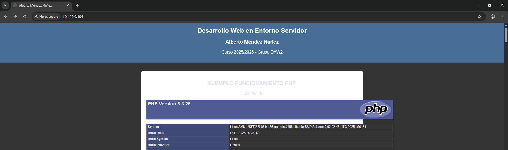

---

#### **HTTP a HTTPS Server**

Así funciona HTTPS:
  

En primer lugar habilitamos el modulo "ssl"

```bash
sudo a2enmod ssl    #Habilitamos el módulo ssl.
```

Después crearemos el certificado autofirmado:

```bash
sudo openssl req -x509 -nodes -days 365 -newkey rsa:2048 -keyout /etc/ssl/private/amn-used.key -out /etc/ssl/certs/amn-used.crt

#Creamos un certificado autofirmado y almacenamos la clave privada en "/etc/ssl/private" y el certificado en "/etc/ssl/certs".
```

Comprobamos que se ha creado correctamente con:

```bash
sudo ls /etc/ssl/certs | grep amn-used    #Comprobamos que el certificado se ha creado correctamente.

sudo ls /etc/ssl/private | grep amn-used    #Comprobamos que la clave privada se ha creado correctamente.
```
Reiniciamos el servicio de apache:

```bash
sudo systemctl restart apache2
```

Nos dirigiremos al directorio "/etc/apache2/sites-available" y haremos una copia del fichero "default-ssl.conf"

```bash
sudo cp default-ssl.conf amn-used.conf
```

Dentro de la copia cambiaremos el nombre del certificado y de la clave por los que indicamos al crearlo:

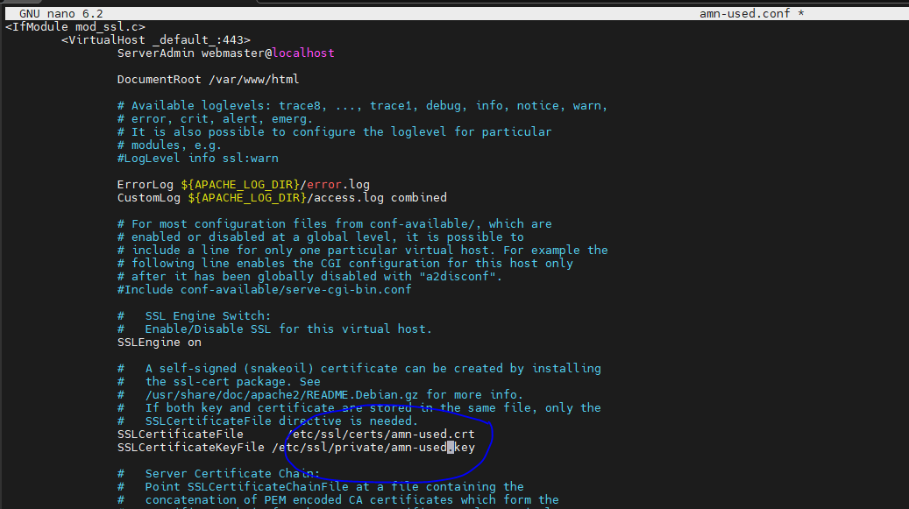

Después activaremos el nuevo sitio:

```bash
sudo a2ensite amn-used.conf
```

Reiniciamos el servicio de apache:

```bash
sudo systemctl restart apache2
```

Y por último habilitaremos el puerto 443 en el cortafuegos:

```bash
sudo ufw allow 443
```

Comprobamos:

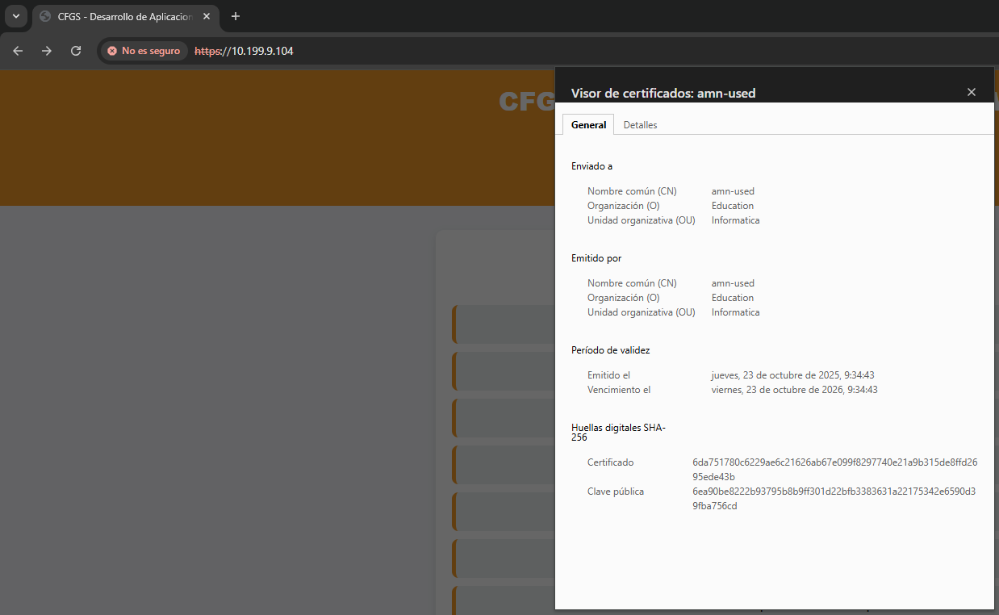

#### **Redirección de HTTP a HTTPS Server**
Para redireccionar apache HTTP a HTTPS deberemos de habilitar el módulo "rewrite" y editar el fichero ".htaccess" del directorio raíz de publicación y añadiremos las siguientes directivas.

En primer lugar habilitaremos el módulo "rewrite":

```
sudo a2enmod rewrite
```

Después reiniciaremos apache:

```
sudo systemctl restart apache2
```

A continuación en el fichero ".htaccess" del raíz de publicación podremos las siguientes directivas:


Y al finalizar reiniciaremos de nuevo apache y podremos comprobar que al acceder a la URL mediante http el servidor redirecciona automáticamente a https.

##### **Virtual Hosts**
Vamos a configurar un sitio virtual llamado "sitio1.albertomennun.ieslossauces.es".

Para ello en primer lugar, deberemos de acceder al panel de configuración de nuestro hosting, y clicaremos en el apartado "Hosting y DNS" y en la opción "DNS"
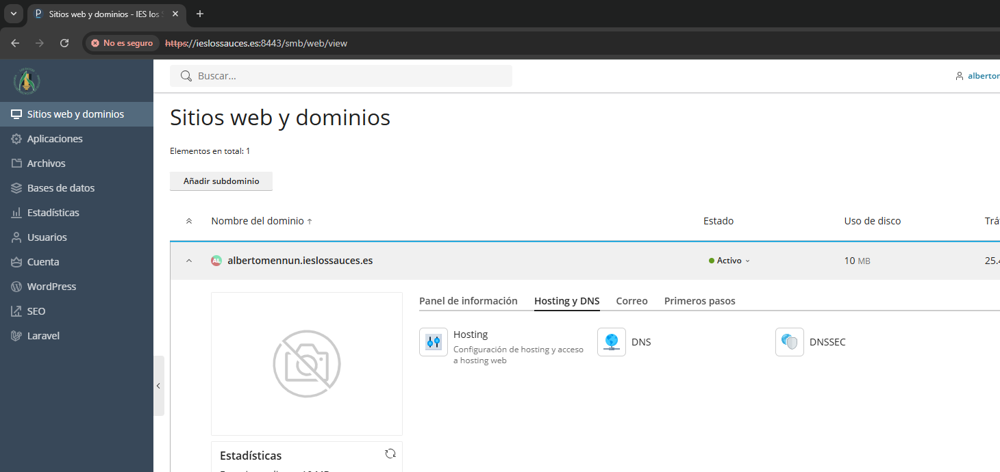

A continuación clicaremos en "+ Añadir registro"
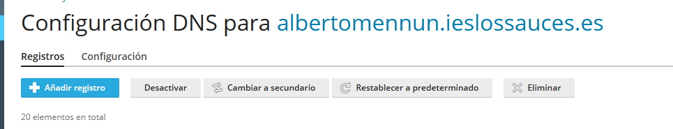

Después le podremos indicar el tipo de registro, el nombre de dominio, el TTL (Time To Life) y la dirección IP de nuestro servidor.
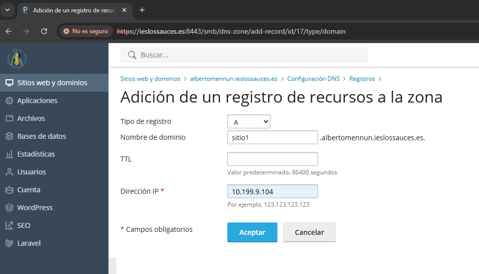


Como podemos comprobar se ha creado correctamente.


Ahora vamos a configurar nuestro sitio en nuestro servidor apache.

En primer lugar deberemos de ir al directorio "/etc/apache2/sites-available" y copiaremos el sitio "000-default.conf" con el nombre de nuestro sitio remplazando los puntos por guiones .conf "sitio1-albertomennun-ieslossauces-es.conf".


Editaremos el fichero y añadiremos el "ServerName" y modificaremos el "DocumentRoot", el "ErrorLog" y el "ProxyPassMatch".


A continuación nos dirigiremos al directorio "/var/www/usuarioEnjaulado1" y crearemos el directorio "error".


Después comprobaremos los permisos de la carpeta error y modificaremos su propietario para que sea "usuarioEnjaulado1" y al grupo "www-data". También cambiaremos los permisos de la carpeta a 775.


Luego deberemos de habilitar el sitio y reiniciar el servicio apache.


A continuación nos conectaremos mediante SFTP con el usuario usuarioEnjaulado1 y en la carpeta htdocs pegaremos la aplicación que queremos subir.
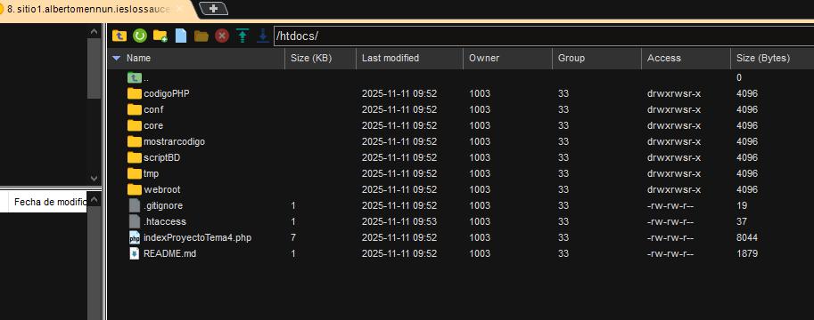

Después modificaremos el archivo ".htaccess" y indicaremos el "DirectoryIndex" que en este caso es "indexProyectoTema4.php".


Y por ultimo comprobamos que accediendo en el navegador a "sitio1.albertomennun.ieslossauces.es" nos llevará a nuestro nuevo sitio.


###### **Varios sitios HTTPS**
A continuación vamos a hacer que podamos tener varios sitios HTTPS en nuestro servidor web.


En primer lugar crearemos un certificado autofirmado, y le daremos nombre a la clave privbada y al certificado:

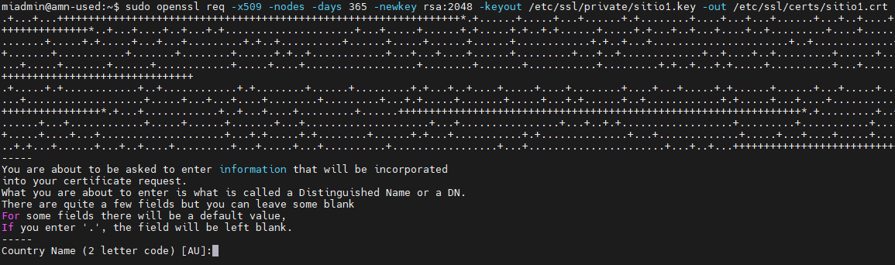

En la información que tenemos que introducir al crear el certificado, en el apartado de "Common Name" deberemos de introducir el nombre que va a tener nuestro sitio, en este caso "sitio1.albertomennun.ieslossauces.es"

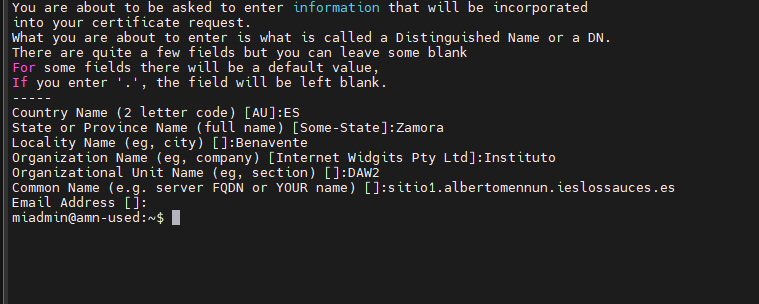

A continuación nos dirigiremos al directorio "/etc/apache2/sites-available" y haremos una copia del archivo "default-ssl.conf" y la llamaremos "sitio1-ssl.conf"

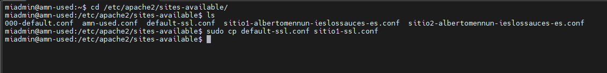

Lo editaremos, y deberemos de introduicir un "ServerName" y un "DocumentRoot".
También deberemos editar los "ErrorLog" poniendo un nombre de archivo diferente al por defecto para en caso de algun error en nuestra página poder identificar facilmente el archivo log.ç
Importante también cambiar el certificado y la clave como se ve en la parte inferior de la captura.

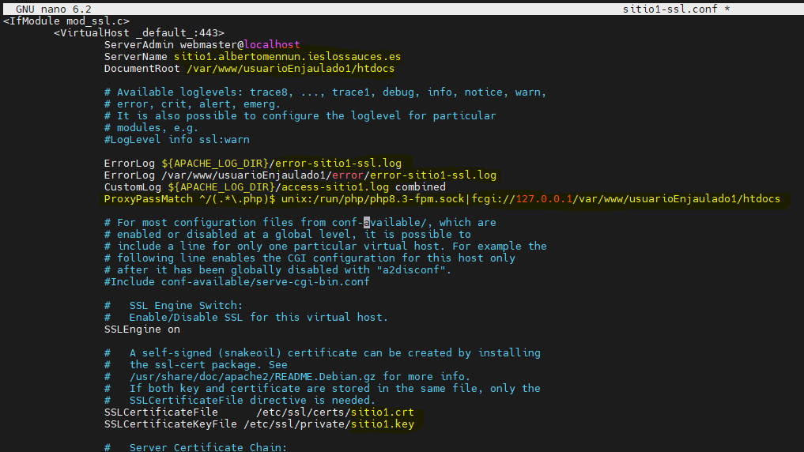

Guardaremos el archivo y activaremos el sitio que acabamos de configurar y reiniciaremos el servicio apache.

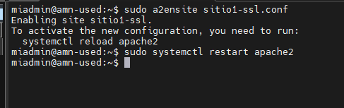

Al hacer esto ya funcionaria nuestro sitio HTTPS, como ejemplo he subido una release de el proyecto tema 4 de DWES de Gonzalo y como se ve en la captura funciona correctamente.

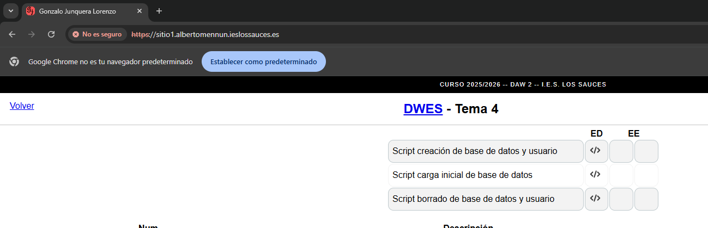

Funciona como esperabamos pero vamos a redireccionar HTTP a HTTPS para que siempre que accedamos accedamos con HTTPS.
Para ello en el archivo ".htacces" del proyectoTema4 de gonzalo que hemos subido a nuestro sitio, deberemos de indicar el "DirectoryIndex" (indice de nuestra página) y añadiremos las líneas que corresponden al módulo "Rewrite" para hacer la redirección de HTTP a HTTPS.
Importante en la línea "RewriteRule" indicar la URL con HTTPS ya que es a la URL a la que se va a redireccionar.

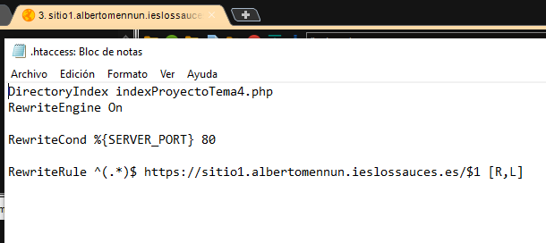

##### **Permisos y usuarios**
Creamos una cuenta para la publicación de contenidos en nuestra web:
  ```
  sudo adduser --home /var/www/html --ingroup www-data --shell /bin/bash operadorweb

  sudo chown -R operadorweb:www-data /var/www/html

  sudo chmod -R 775 /var/www/html
  
```

#### **1.1.3 PHP8.3-fpm**
##### **Instalación**

 ```

  sudo apt install php8.3-fpm php8.3 -y

  sudo a2enmod mpm_event proxy_fcgi
  ```

  Configuramos el sitio activo:

  ```
  
  cd /etc/apache2/sites-enabled/

  sudo nano 000-default.conf

  ProxyPassMatch ^/(.*\.php)$ unix:/run/php/php8.3-fpm.sock|fcgi://127.0.0.1/var/www/html
  ```

##### **Verificación del servicio**
   ```
    sudo service php8.3-fpm status
   ```

##### **Comprobación del servidor**

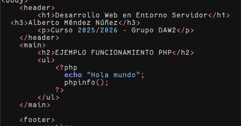

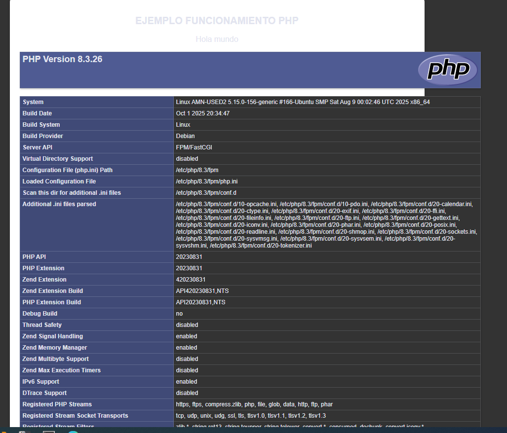

#### **1.1.4 MariaDB**
#### **Instalación**
En primero lugar actualizaremos nuestro servidor con:
```
    sudo apt update
```
Luego instalaremos el servicio "mariadb-server":
```
    sudo apt install mariadb-server
```
Al instalarlo iniciaremos el servicio:
```
    sudo service mariadb start
```
Y comprobaremos el estado con:
```
    sudo service mariadb status
```
Comprobaremos la version de mariadb con:
```
    sudo mariadb --version
```
Entraremos en el fichero de configuración de mariaDB y cambiaremos el apartado "bind-address" por "0.0.0.0":
    sudo nano /etc/mysql/mariadb.conf.d/50-server.cnf
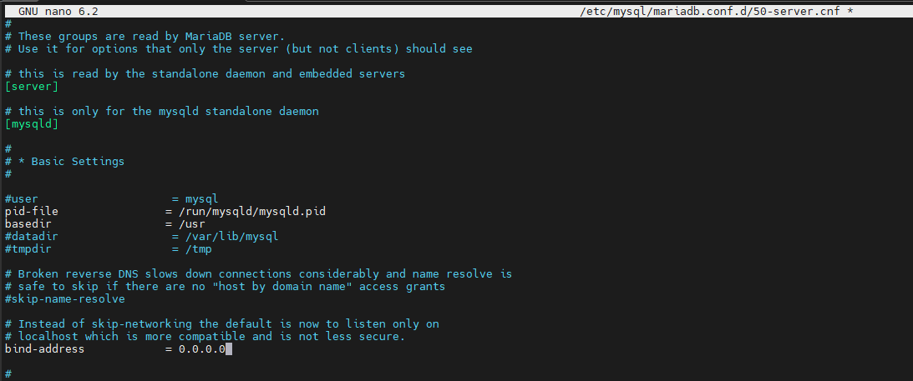

Comprobamos el puerto por defecto que utiliza mariaDB (3306):
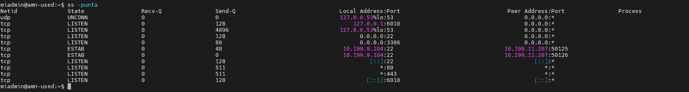

A continuación deberemos de crear un usuario "adminsql" de contraseña "paso".
Para ello entraremos en la consola de MariaDB con "sudo mariadb" y los siguientes comandos:

Creación del usuario:

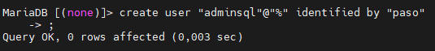

Configuración de permisos de administrador:

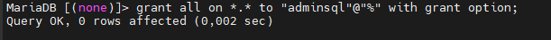

Mysql tiene un modo de instalación seguro para evitar brechas de seguridad, lo ejecutaremos con "sudo mysql_secure_installation" y responderemos a las preguntas en función de nuestras preferencias:
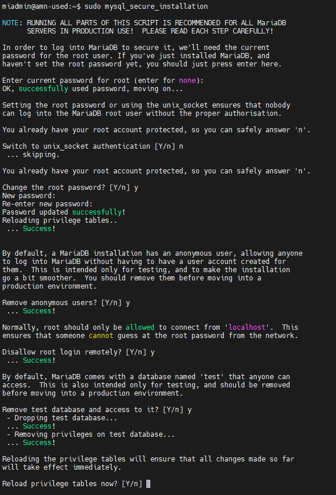

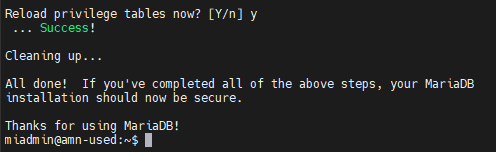

Una de las preguntas ha sido si queríamos que el usuario "root" tuviera contraseña, lo comprobamos con el siguiente comando:
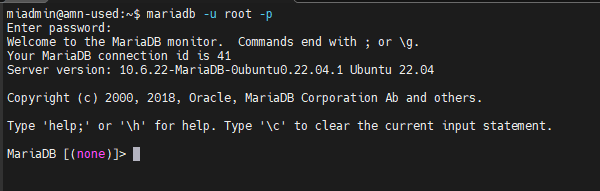


#### **Módulos relacionados con PHP**
Deberemos de instalar el módulo que integra mysql con php8.3-fpm con:
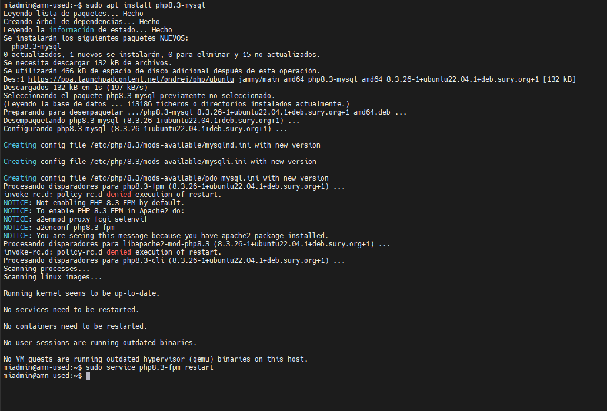

Comprobaremos que se ha instalado correctamente con:
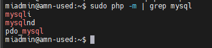

#### **Comprobación desde NetBeans**
En primer lugar deberemos de ir al apartado de "Services" y hacer clic derecho en "Databases". Deberemos de entrar en "New Connection...":

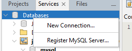

A continuación deberemos de elegir el driver que queremos utilizar, en este caso MariaDB (MySQL-compatible) y indicarle el archivo del driver que hemos bajado de internet:

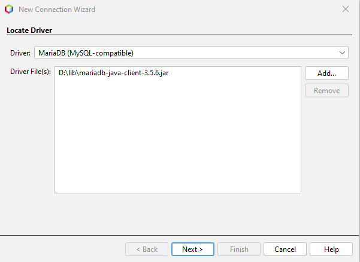

Deberemos de indicar la IP de nuestro servidor, el puerto, la base de datos a la que queremos conectarnos, y el usuario y password que hemos creado anteriormente:
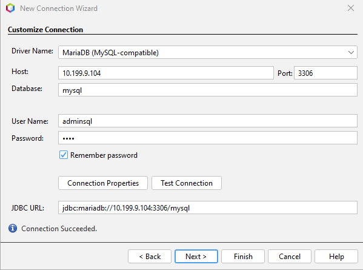


Como podemos comprobar nos hemos conectado correctamente:
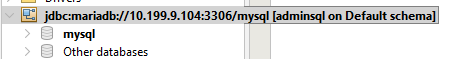

Para ejecutar un script deberemos de hacer click derecho en la conexión y entraremos en "Execute Command":
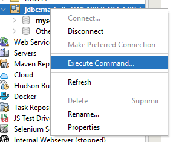


#### **1.1.5 XDebug**

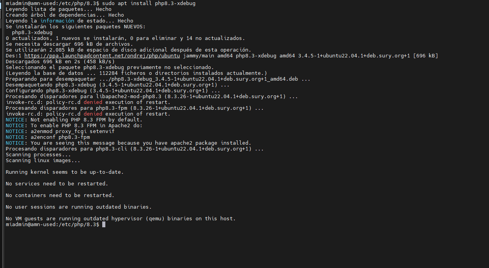
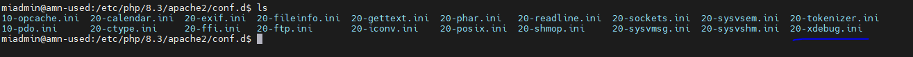
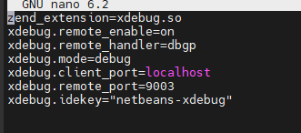

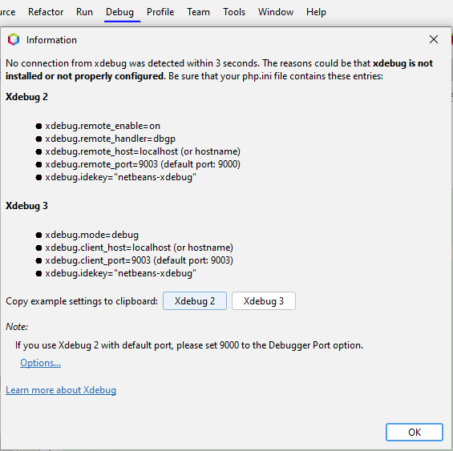

#### **1.1.6 DNS**
#### **1.1.7 SFTP**


##### **Enjaular un usuario**

Vamos a enjaular el usuario "usuarioEnjaulado1" en el directorio "/var/www/usuarioEnjaulado1".

Para ello, en primer lugar, deberemos de crear un grupo en el que vamos a meter los usuarios que queramos enjaular:
```
  sudo addgroup sftpusers
```


A continuación crearemos el usuario "usuarioEnjaulado1", haciendo que pertenezca a los grupos "www-data" y "sftpusers", además haremos que el home del usuario sea "/var/www/usuarioEnjaulado1":


Después cambiaremos el propietario del directorio "/var/www/usuarioEnjaulado1" a "root" y cambiaremos los permisos a solo lectura:


Crearemos la carpeta "htdocs" en "/var/www/usuarioEnjaulado1" y cambiaremos los permisos de la carpeta y su propietario que ahora será "usuarioEnjaulado1":


A continuación nos dirigiremos al directorio "/etc/ssh" y haremos una copia de seguridad del fichero "sshd_config" y editaremos el fichero existente, no la copia:


Reiniciaremos el servicio:

```
  sudo service ssh restart
```

Por ultimo nos conectaremos mediante sftp y el usuario "usuarioEnjaulado1" y comprobaremos que el usuario no puede moverse de el directorio indicado:


#### **1.1.8 Apache Tomcat**
#### **1.1.9 LDAP**
#### **2.0.0 PHPMyAdmin**
Vamos a instalar "phpmyadmin" en nuestro servidor web.
En primer lugar crearemos un archivo "listarmodulos.txt" en el que almacenaremos el resultado de el comando "php -m", que muestra todos los módulos instalados referentes a PHP. Hacemos esto para al finalizar la instalación de "phpmyadmin" comprobar los módulos adicionales de PHP que se han instalado.

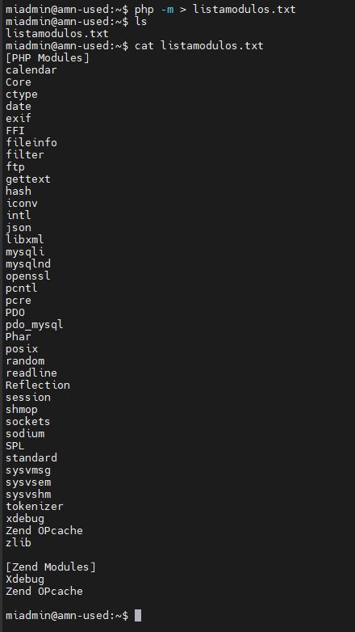

Instalamos "phpmyadmin"

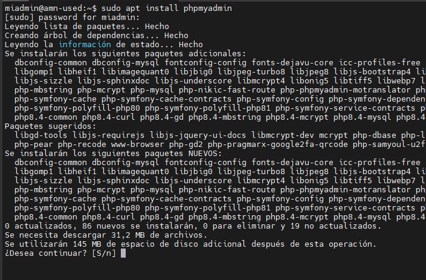

A continuación deberemos de elejir la opción "apache2" para que phpmyadmin se configure automaticamente para apache2, seleccionaremos con la barra espaciadora y continuaremos.

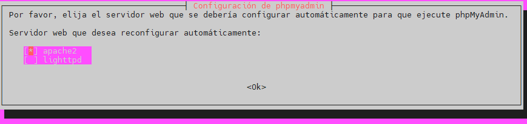

Elejiremos la opción "yes" para configurar la base de datos de "phpmyadmin".

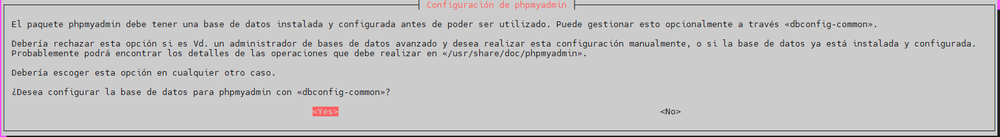

Le pondremos una contraseña a MySQL.

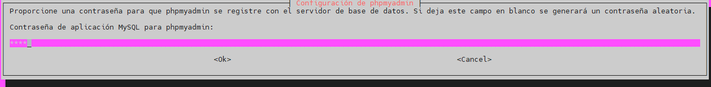

Y por último antes de comprobar haremos un nuevo archivo en el que listaremos los módulos de php de nuevo para comprobar los nuevos que se han instalado.

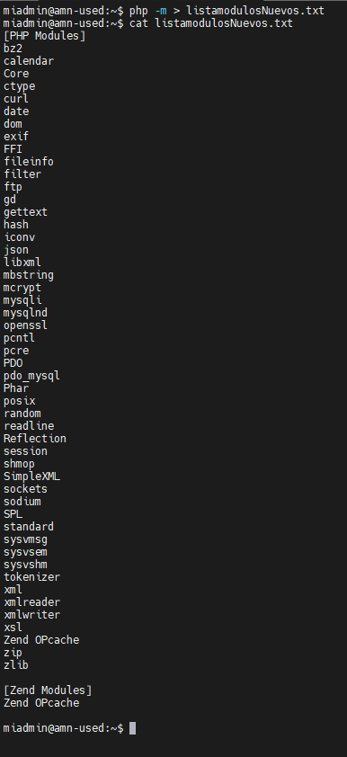
