## 📑 Índice

- [1. Creación de proyectos](#1-creación-de-proyectos)
- [2. Configuración de Git en NetBeans](#2-configuración-de-git-en-netbeans)
- [3. Configuración de xDebug](#3-xdebug)
- [4. phpDocumentor](#4-phpdocumentor)
  - [4.1 Requisitos mínimos](#41-requisitos-mínimos)
  - [4.2 Sistema](#42-sistema)
  - [4.4 Instalación de dependencias](#44-instalación-de-dependencias)
  - [4.5 Configuración de variables de entorno (nivel de cuenta)](#45-configuración-de-variables-de-entorno-nivel-de-cuenta)
  - [4.6 Uso de phpDocumentor](#46-uso-de-phpdocumentor)
  - [4.7 Observaciones](#47-observaciones)
- [5. Apache Tomcat](#5-apache-tomcat)


##### **1. Creación de proyectos**

Para crear un proyecto en NetBeans deberemos de clicar en "File/New Project".


Después clicaremos en la categoría de "PHP" y el tipo "PHP Application from Remote Server".


Le daremos un nombre a nuestro proyecto y indicaremos la URL en la que se almacenará el proyecto.


Indicaremos también la URL con la que buscaremos la página en el navegador (IP dek servidor) y el directorio de publicación.


Mediante SFTP crearemos un archivo "index.html" dentro del directorio de publicación.


Confirmaremos los archivos que queramos sincronizar.


Y comprobaremos que cuando cambiamos algo en NetBeans se ejecutan los cambios en la web del servidor.


##### **2. Configuración de Git en NetBeans**

En primer lugar deberemos de dirigirnos a nuestro repositorio de GitHub y copiaremos la URL del repositorio clicando en "<> Code" y en el apartado HTTPS.


En NetBeans en el apartado "Team" deberemos de clicar en la opción de "Git" y en la opción "Clonar..."


Pegaremos la URL de nuestro repositorio y indicaremos el usuario y la contraseña de la cuenta de GitHub. También deberemos de indicar la carpeta de destino.


Podremos a su vez indicar que ramas queremos de las que tiene el repositorio. (Si tuviera más aparecerían aquí).


Indicaremos el directorio padre y el nombre de la clonación.


Al finalizar nos dirá si queremos crear un proyecto a partir del repositorio.


Indicaremos el tipo de proyecto.


Le pondremos un nombre y le indicaremos un directorio.


Indicaremos la URL del servidor y su directorio de publicación.


Confirmaremos los archivos.


Y como podemos ver en el Repository Browser tenemos toda la información sobre la clonación.


Al hacer clic derecho en "Source Files" de nuestro proyecto, en el apartado de "Git" podremos administrar todo, por ejemplo hacer un commit, merge etc.


#### 3. **xDebug**

En nuestro IDE, deberemos de dirigirnos a "Tools/Options/PHP/Debugging", y deberemos de comprobar que el puerto de debugg es el 9003.

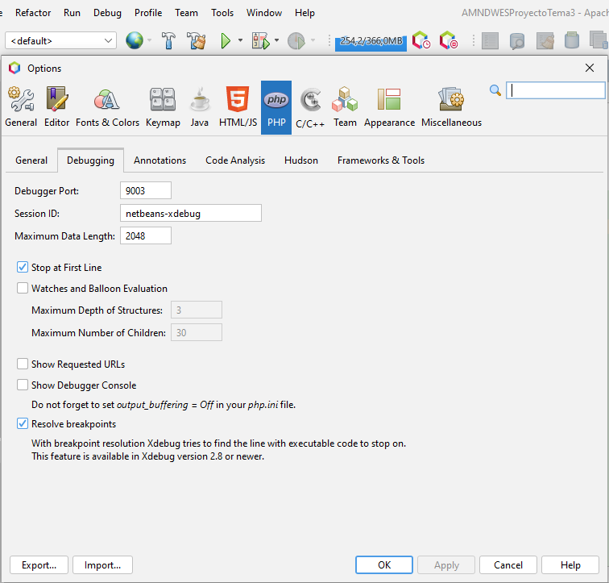

#### 4. **phpDocumentor**

### 4.1 Requisitos mínimos

Para poder utilizar phpDocumentor en el entorno de desarrollo es necesario cumplir los siguientes requisitos:

### 4.2 Sistema

    Sistema Operativo: Ubuntu Server 20.04 LTS o superior

    Acceso: Usuario con permisos de instalación (sudo)

### 4.3 Software:

PHP: versión 8.1 o superior

    Composer: versión 2.x

Extensiones PHP requeridas:

    php-cli
    php-xml
    php-mbstring
    php-curl

### 4.4 Instalación de dependencias

Actualizar el sistema e instalar PHP con las extensiones necesarias:

```bash
sudo apt update
sudo apt install -y php php-cli php-xml php-mbstring php-curl unzip git
```

### 4.5 Configuración de variables de entorno (nivel de cuenta)

Para que el comando phpDocumentor esté disponible desde cualquier ubicación, es necesario añadir Composer al PATH del usuario.

Editar el archivo .bashrc del usuario:
```bash
nano ~/.bashrc
```

Añadir la siguiente línea al final del archivo:
```bash
export PATH="$HOME/.config/composer/vendor/bin:$PATH"
```

Aplicar los cambios:
```bash
source ~/.bashrc
```

### 4.6 Uso de phpDocumentor
Desde la raíz del proyecto PHP:
```bash
phpDocumentor -d src -t docs
```

Donde:

    src -> contiene el código fuente PHP

    docs -> será el directorio donde se generará la documentación HTML

### 4.7 Observaciones

    La instalación se realiza a nivel de cuenta, no del sistema completo.

    Cada usuario del servidor deberá configurar su propio PATH.

    Se recomienda mantener PHP y Composer actualizados para evitar incompatibilidades.


### 5. Apache Tomcat

Vamos a desplegar un proyecto Maven/Web Aplication en nuestro servidor Apache Tomcat mediante NetBeans.

IMPORTANTE: Tener el servidor Tomcat arrancado antes de proceder.

En primer lugar clicaremos en "New Project" y seleccionaremos las opciones de "Java with Maven" y el tipo de proyecto será "Web Aplication".
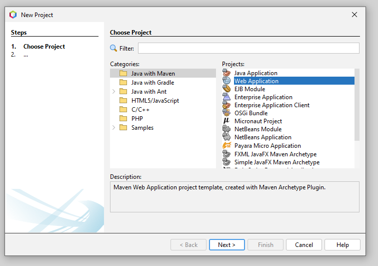

Indicaremos el nombre del proyecto y donde se va a encontrar, en este caso se llamará "AMNDAWProyectoTomcat" y se encuentra en "D:\ProyectosNetBeans". También cambiaremos el apartado "Version" a la 1.0, ya que es nuestra primera versión.
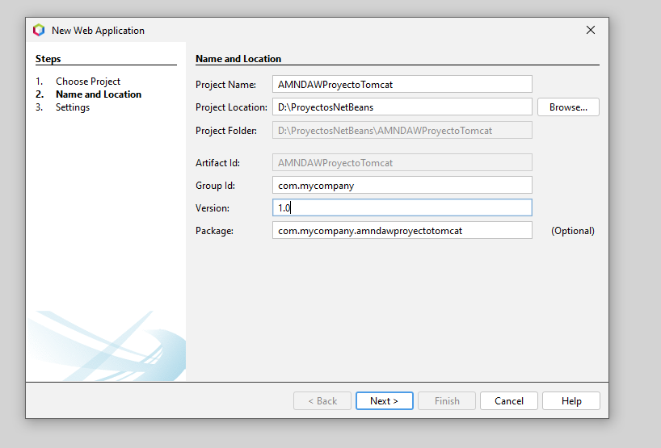

A continuación indicaremos nuestro servidor, que en este caso será el servidor Tomcat que tenemos arrancado y la versión de Jakarta.
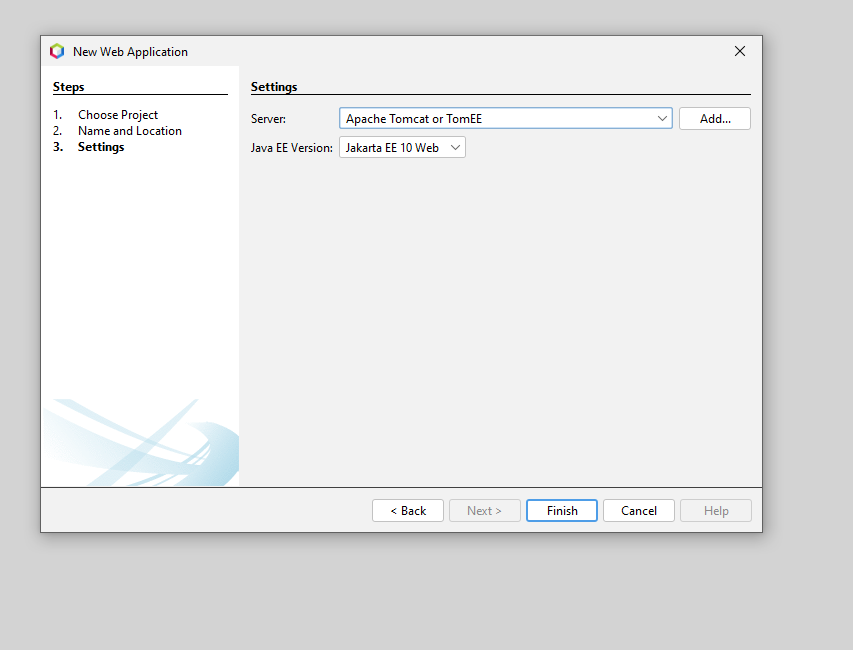

Como podemos comprobar, se ha creado el proyecto correctamente.

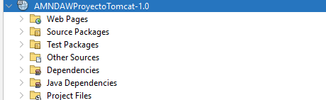

A continuación, vamos a crear un nuevo archivo de tipo "JSP"

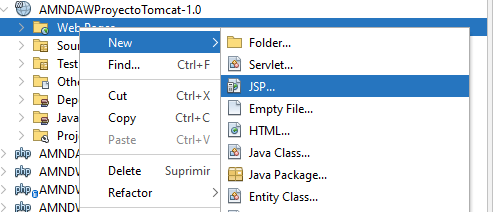

Lo llamaremos index, la localización será "Web pages" y utilizaremos la syntaxis estandar.

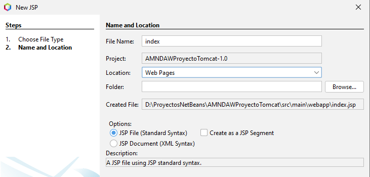

También vamos a crear un "Servlet" .

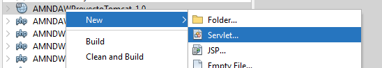

Lo llamaremos "login".

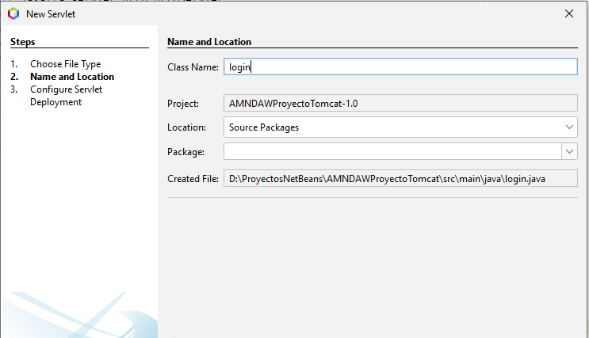

Aquí podemos ver el Servlet del login.

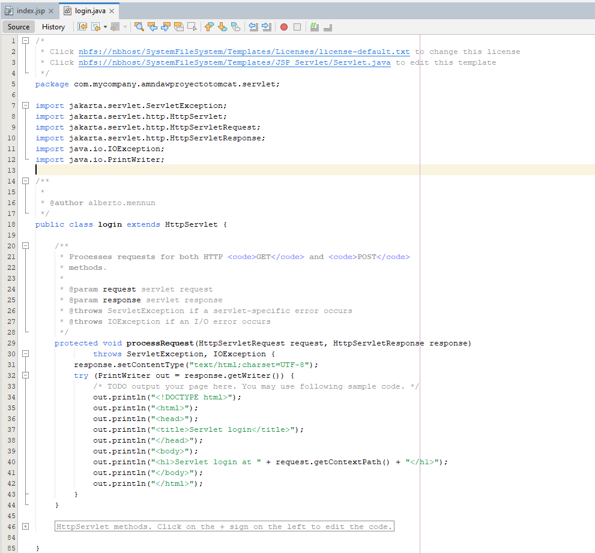

A continuación en las propiedades del proyecto, en el apartado "Run", comporbaremos que la configuración es la correcta.

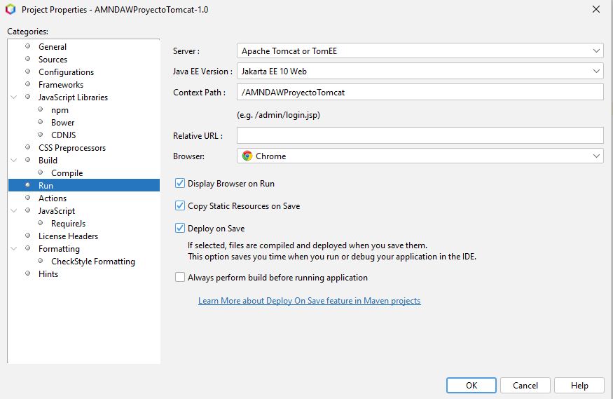

Después de hacer esto, si buscamos la URL "localhost:8080/AMNDAWProyectoTomcat/" podemos ver que aparece el mensaje "Hello World!"

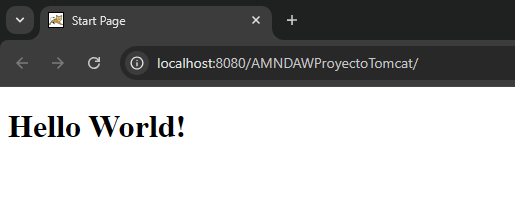

También si buscamos la URL "localhost:8080/AMNDAWProyectoTomcat/login" nos aparecerá la página del Servlet.

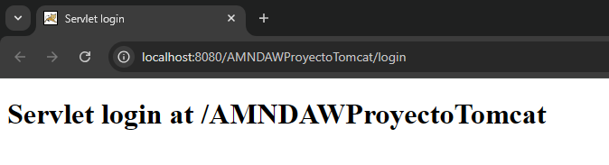

Por último, si nos dirigimos al apartado "Servers" de NetBeans, podemos ver que se ha añadido el nuevo proyecto que acabamos de desplegar.

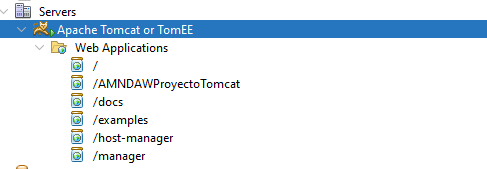
