# 2. **GitHub**

Utilizaremos GitHub para subir nuestros proyectos y versionarlos poco a poco.
En cada proyecto tendremos una rama developer y una rama master.

## 2.1. Ramas principales
- **master**: Rama estable, lista para producción.
- **developerAMN**: Rama de desarrollo, donde se integran nuevas funcionalidades y cambios antes de pasarlos a `master`.

## 2.2. Crear un repositorio
1. Entraremos a [GitHub](https://github.com/) y en nuestros repositorios, haremos click en **New repository**.
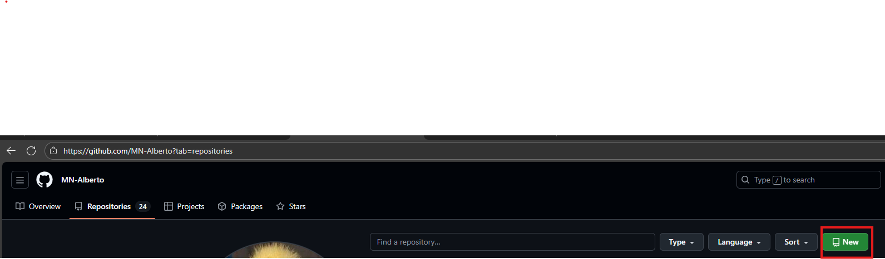
2. Le daremos un nombre a nuestro repositorio y, opcionalmente, una descripción.
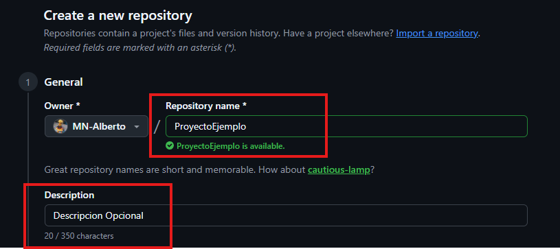
3. Al crearlo podemos indicar si el repositorio será **público** o **privado**.
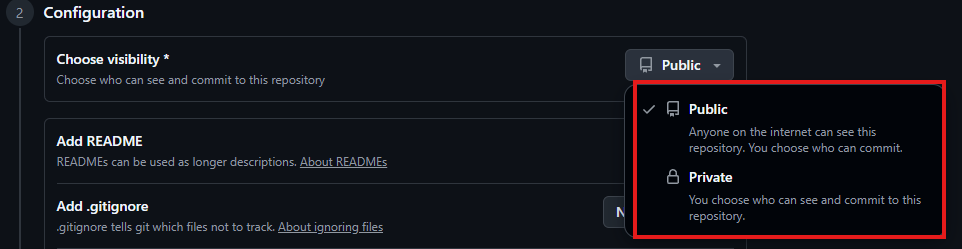
4. Podremos crear el repositorio con un archivo `Readme.md` de primeras.
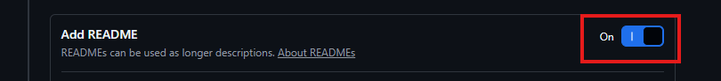
5. Haz click en **Create repository** y ya se crearía nuestro repositorio.
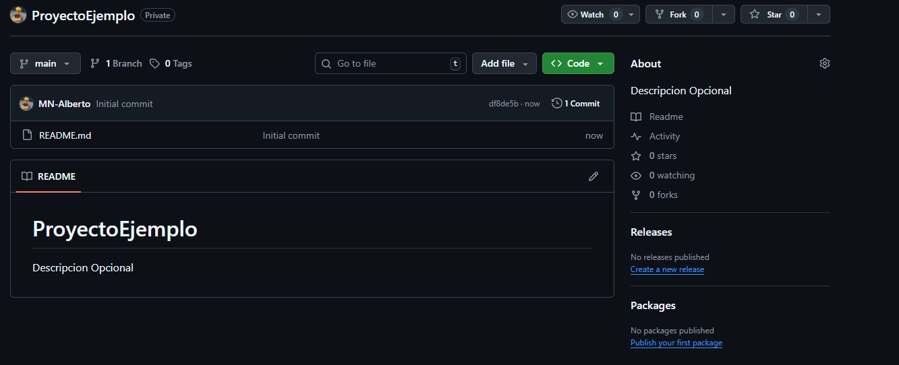

## 2.3. Crear y gestionar ramas

Vamos a crear la rama ``developerAMN`.
Para ello, deberemos de clicar en el desplegable de las ramas, y clicaremos en "View all branches"

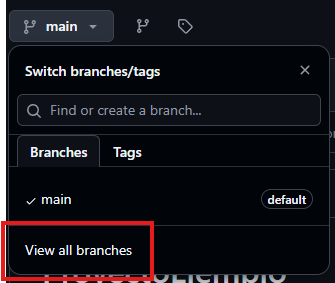

Aquí podremos ver todas las ramas que tenemos en nuestro repositorio y las podremos editar, nosotros vamos a crear una nueva asi que deberemos de clicar en "New branch"
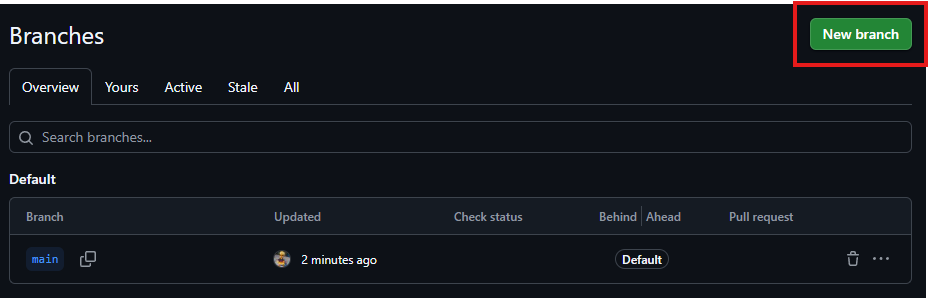

Al crear la rama, deveremos de indicarle un nombre, en este caso "developerAMN" y la rama de origen que queremos que tenga, en este caso la rama master.

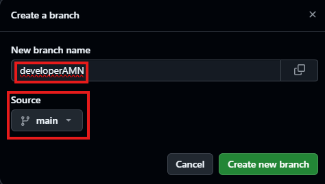

Al crearla podremos ver la rama por defecto de nuestro repositorio, asi como todas las ramas que tiene y las ramas activas.

Para cambiarnos de rama deberemos de clicar de nuevo en el desplegable y seleccionar la rama que queramos utilizar.

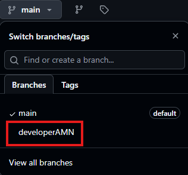

## 2.4. Commit y merge con la rama Master

Vamos a realizar nuestro primer commit a nuestra rama developerAMN para después hacer un merge con la rama master.

Para ello en primer lugar clicaremos en el desplegable de "Add file" y clicaremos en "Upload files".

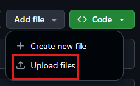

Aquí podremos seleccionar los archivos que queramos subir, nosotros subiremos un archivo de ejemplo. También debemos indicar un mensaje y una descripción para nuestro commit. Podremos hacer el commit directamente a la rama developerAMN o crear una nueva rama para este commit.

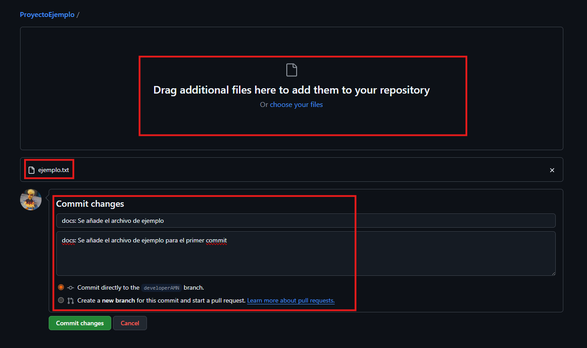

Cuando hayamos clicado en "Commit changes" veremos que aparece un mensaje para comparar y hacer una "Pull request"

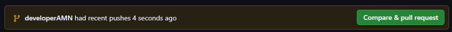

Le indicaremos un titulo y un mensaje y crearemos la request.

Al hacerlo nos aparecerá un mensaje para hacer una solicitud de merge con la rama master.

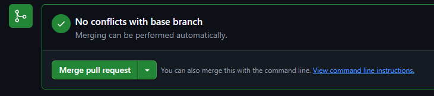

Nos pedirá un titulo y una descripción.

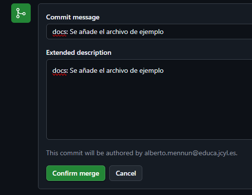

Al confirmar el merge, ambas ramas se fusionarán y tendran el archivo que hemos subido en nuestro primer commit.

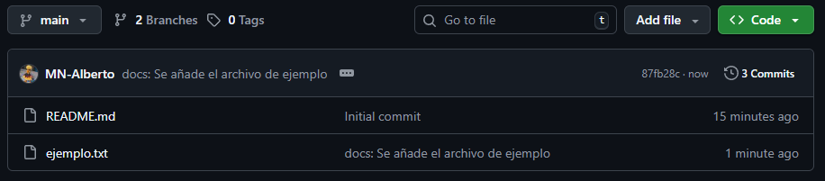

## 2.5 Creación de Tags y Releases

Vamos a crear una release de nuestro proyecto de ejemplo.

Para ello deveremos de clicar en "Create a new release" en nuestro repositorio.

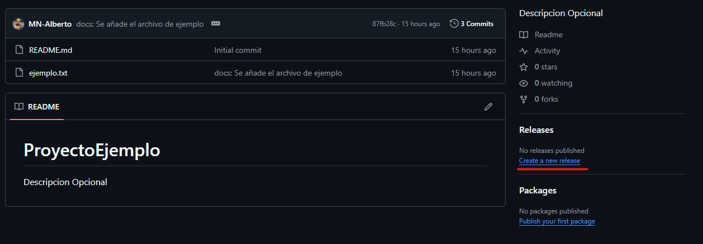

Después, como no tenemos nigun Tag creado, deberemos de crear uno. Para ello deberemos de clicar en "Select tag".

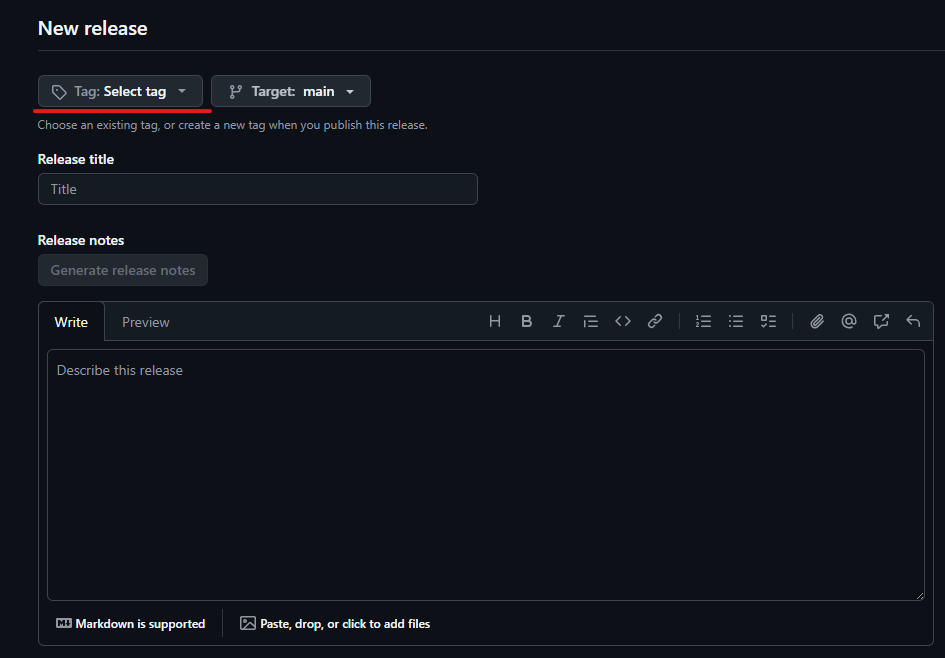

Clicaremos en "Create new tag" para crear un Tag nuevo.

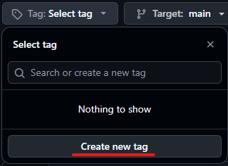

Aquí podremos ponerle un nombre a nuestro primer tag, nosotros vamos a llamarlo "v1.0.0" ya que va a ser nuestra primera versión funcional del repositorio.

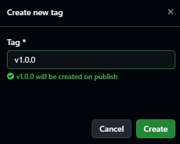

Al haberla creado, la seleccionaremos, le pondremos un titulo a nuestra release, en este caso el mismo que el tag, y también podremos indicar una descripción de lo que contiene. También podemos elejir a que rama queremos que se publique nuestra release.

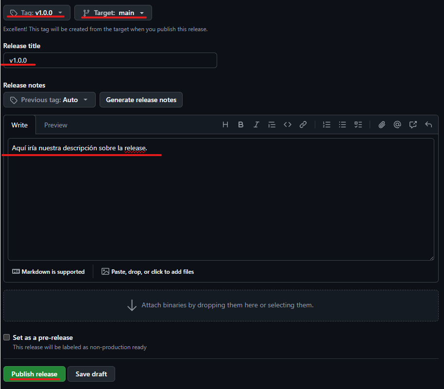

Después de crearla, ya podriamos descargar el código/archivos de nuestro repositorio en el momento de hacer la release.

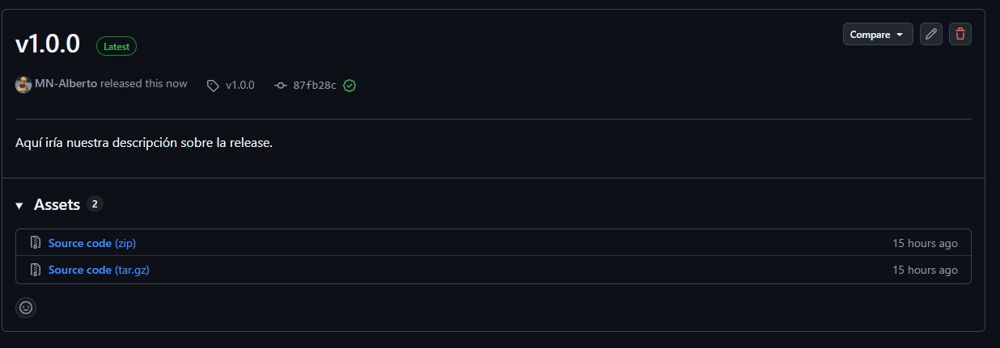