## 📑 Índice

- [1. Entorno de Explotación](#1-entorno-de-explotación)
  - [1.1 Subir archivos a nuestro dominio](#11-subir-archivos-a-nuestro-dominio)
  - [1.2 Creación de subdominios](#12-creación-de-subdominios)
  - [1.3 Creación de la base de datos en Entorno de Explotación](#13-creación-de-la-base-de-datos-en-entorno-de-explotación)
  - [1.4 Creación de certificado con Let's Encrypt](#14-creación-de-certificado-con-lets-encrypt)
  - [1.5 Sitio Virtual](#15-sitio-virtual)
- [2. Despliegue utilizando Git](#2-despliegue-utilizando-git)

# 1. **Entorno de Explotación**

Nuestra aplicación web estará alojada en Plesk.
Nos conectaremos a nuestro panel de control mediante la url: https://ieslossauces.es:8443/login_up.php

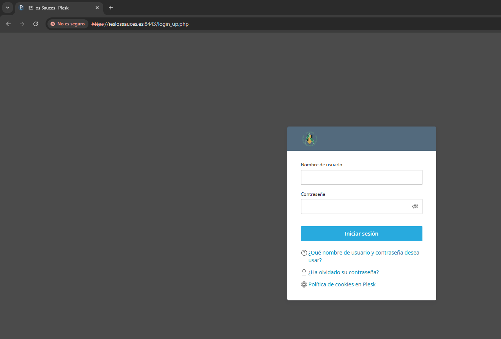

Aquí podremos administrar cualquier aspecto de nuestra pagina

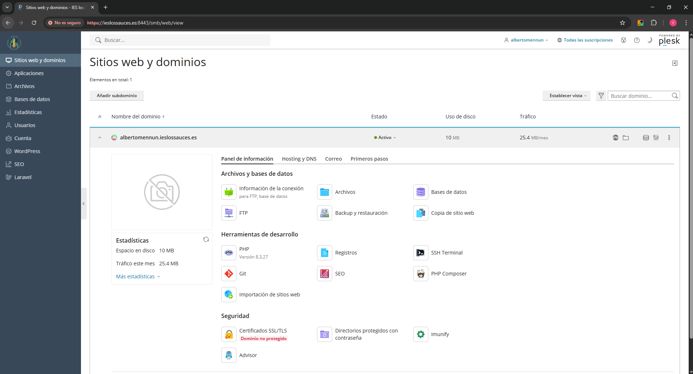

### 1.1 Subir archivos a nuestro dominio.

Para subir archivos a nuestro dominio, lo haremos mediante una conexión SFTP con MobaXterm.
Para ello deberemos de hacer clic en el boton "Session" y elejir la opción "SFTP":

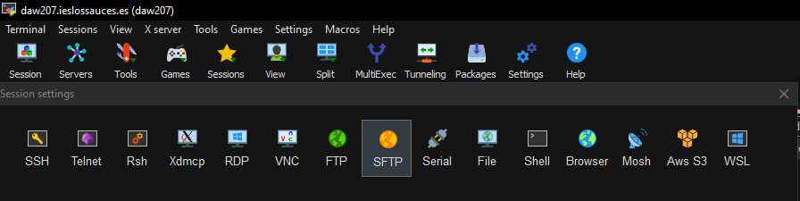

A continuación deberemos de indicar el "Remote host" y el "Username". El remote host será nuestro nombre de dominio, en este caso "albertomennun.ieslossauces.es" y nuestro username "albertomennun":

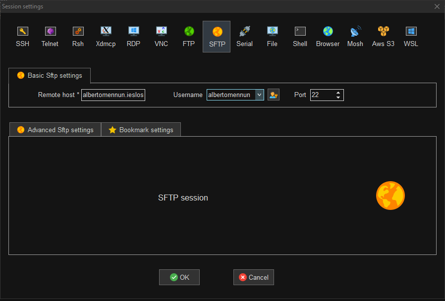

Al conectarnos, los archivos de nuestra página los subiremos en "/httpdocs":

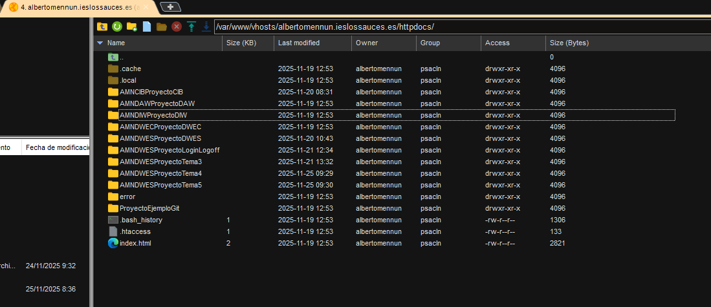

### 1.2 Creación de subominios.

Vamos a crear un subdominio para nuestro proyecto "AMNDWESProyectoTema4", para posteriormente poder relacionar la base de datos con dicho subdominio.

Para ello deberemos de clicar en "Añadir subdominio".

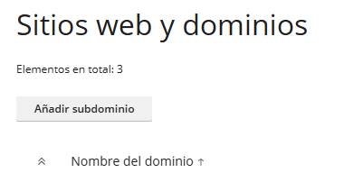

Indicaremos el nombre del subdominio y su directorio raíz, que sera "/httpdocs/AMNDWESProyectoTema4":

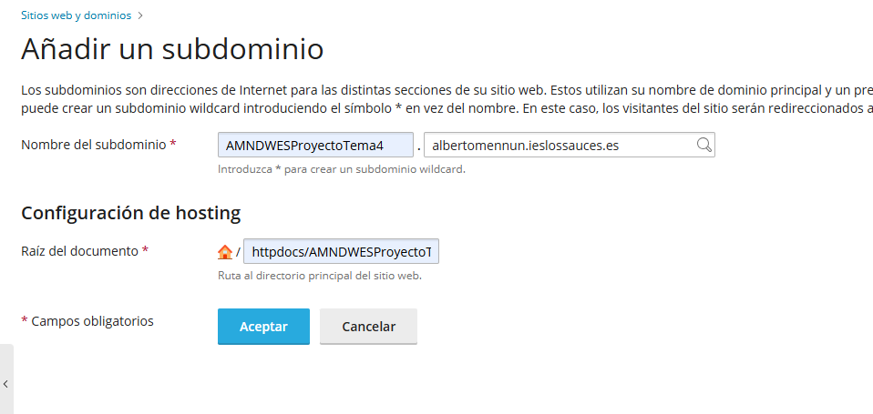

Y como podemos comprobar ya tenemos el subdominio creado:

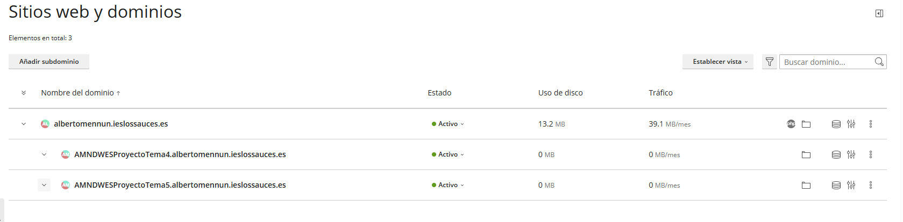

---

### 1.3 Creación de la base de datos en Entorno de Explotación

Para crear una base de datos en explotación, primero deberemos de clicar en "Bases de datos" en el panel de configuración de nuestro dominio.

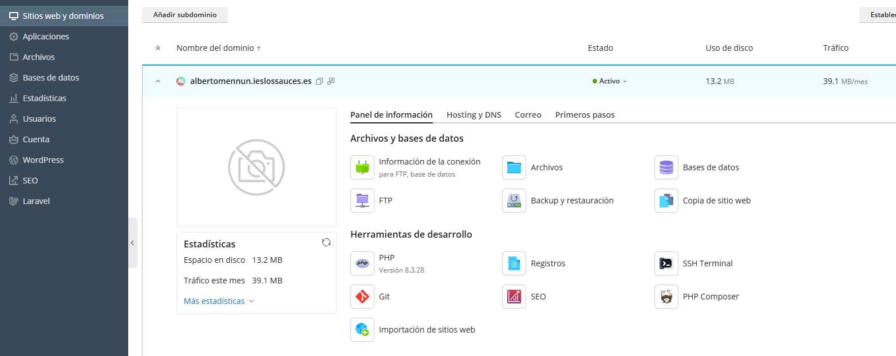

Después clicaremos en "Añadir base de datos".

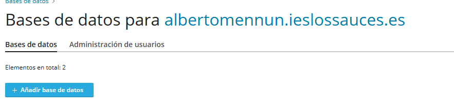

Deberemos darle un nombre a la base de datos, y un subdominio, el que creamos anteriormente. También deberemos indicar el nombre de usuario de la base de datos y su contraseña.

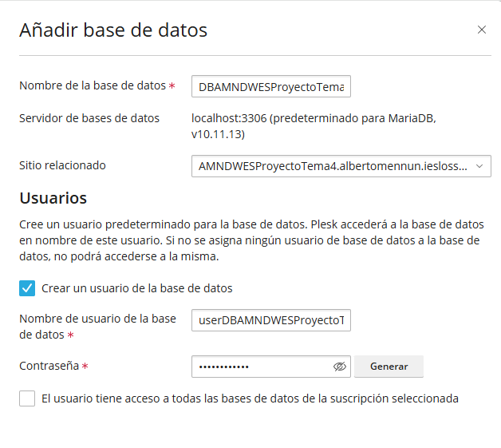

Para subir la base de datos tenemos varias opciones:

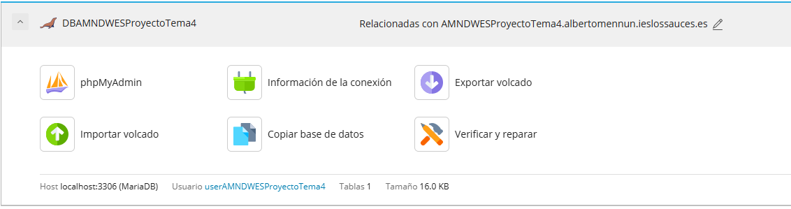

En la opción "Importar volcado", simplemente tendremos que subir el archivo con el script de creación de las tablas y sus inserciones, no deberemos de tener en el script ni la creación de la base de datos ni la creación del usuario ni el borrado de la base de datos.

---

### 1.4 Creación de certificado con Let's Encrypt

Vamos a generar un nuevo certificado con Let's Encrypt para nuestra web en explotación.

En primer lugar, nos dirigiremos al apartado "DNSSEC" de nuestro dominio principal para firmar la zona DNS.

Aquí firmaremos la zona DNS.
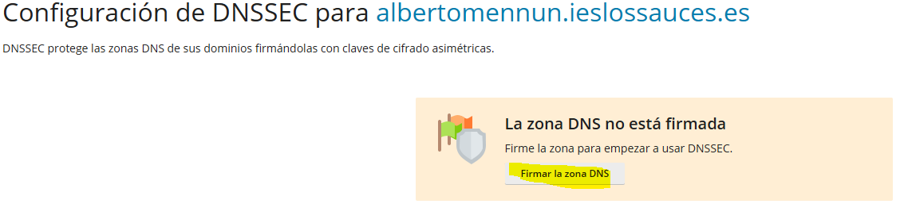

Le indicaremos el algorito de generación "RSASHA256" y aceptaremos.

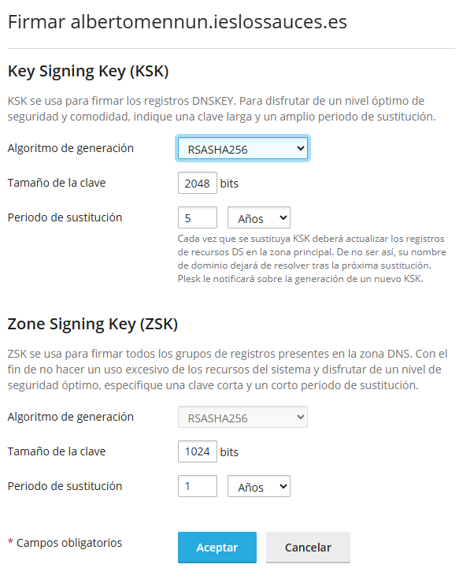

Al aceptar, se generarán unos "Registros de recurso DS".
IMPORTANTE: Deberemos de copiar a partir de "albertomennun.ieslossauces.es. IN DS" todo lo que viene despues en cada uno de los registros.

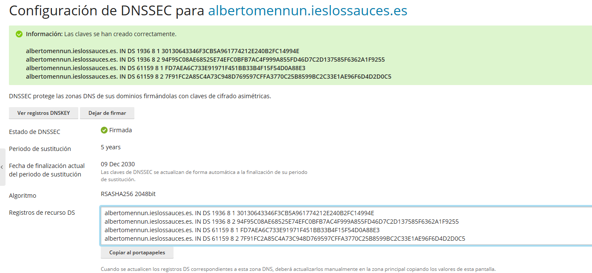

Tras haber copiado los registros, deberemos de crear un registro DS a la zona DNS, indicando el tipo de registro "DS", el nombre de dominio que será "*" y el "Registro DS" que será lo que copiamos anteriormente. Esto por cada uno de los registros, en total 4.

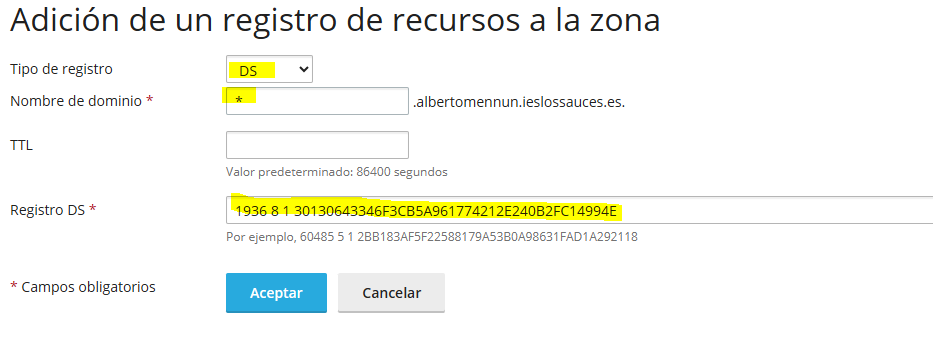

Como podemos comprobar, los hemos creado todos.

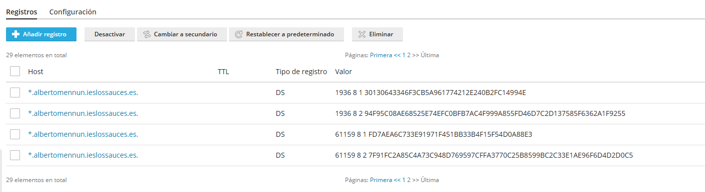

Ahora vamos a generar el certificado. Para eso deberemos ir al apartado de "Certificado SSL/TLS" en nuestro dominio principal.

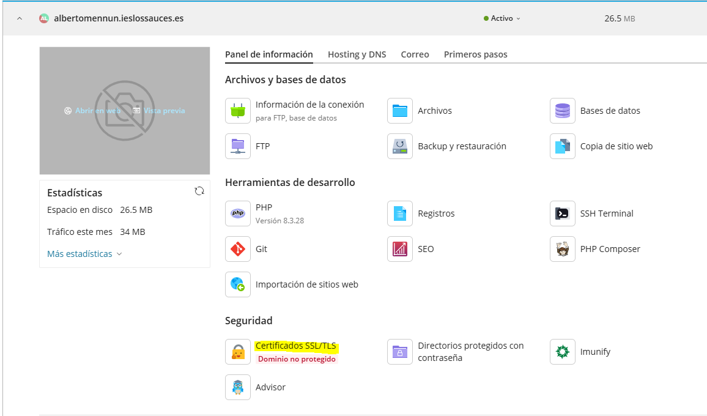

Aquí, deberemos instalar el certificado gratuito de Let's Encrypt.

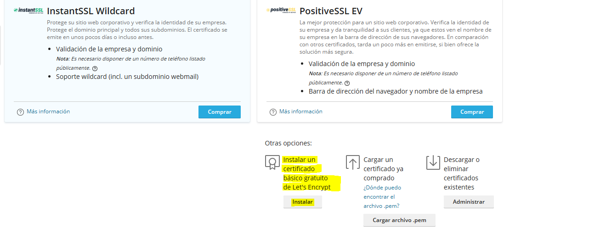

Deberemos indicar que protegemos el dominio wildcard.

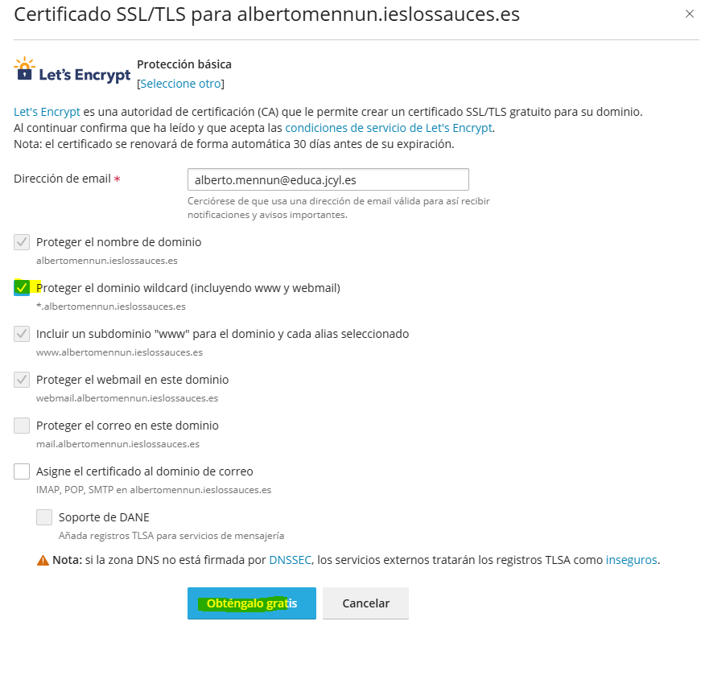

Como vemos la emisión del certidficado está en curso

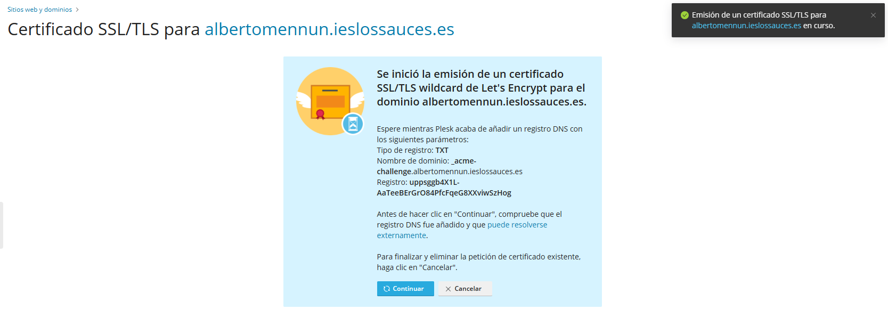

Si copiamos el nombre de dominio y en un terminal hacemos nslookup al nombre, podemos ver la respuesta.

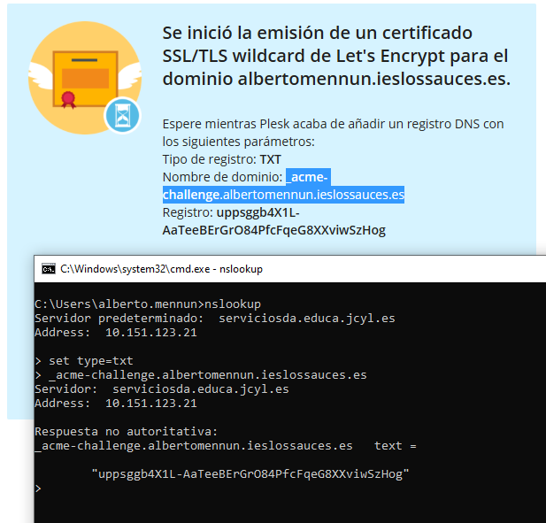

### 1.5 Sitio Virtual

Vamos a configurar un sitio virtual llamado "sitio1.albertomennun.ieslossauces.es".

Para ello en primer lugar, deberemos de acceder al panel de configuración de nuestro hosting, y clicaremos en el apartado "Hosting y DNS" y en la opción "DNS"

A continuación clicaremos en "+ Añadir registro"

Después le podremos indicar el tipo de registro, el nombre de dominio, el TTL (Time To Life) y la dirección IP de nuestro servidor.

Como podemos comprobar se ha creado correctamente.

La continuación se realizará en el apartado "1.1.2.7 Virtual Hosts" de la documentación del servidor de desarrollo.

# 2. **Despliegue utilizando Git**

En este caso, vamos a desplegar nuestra aplicación final de DWES en nuestro entorno de explotación utilizando una release de GitHub.

Previamente, hemos estado realizando commits y merges en nuestro repositorio AMNDWESAplicacionFinal, para poder desplegarlo en explotación, en primer lugar nos dirigiremos a GitHub, y crearemos una nueva release.

Para ello, deberemos de irnos al apartado de "Releases" y clicar en "Draft a new release".
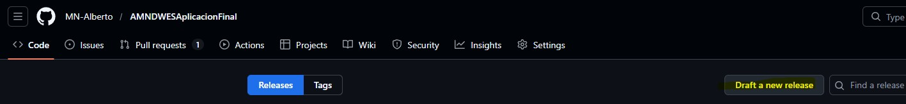

Aquí, deberemos de seleccionar un "tag" para nuestra release, en este caso vamos a crear uno nuevo.

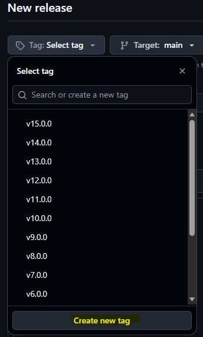

Lo vamos a llamar v16.0.0, ya que es la versión número 16 de la aplicación.

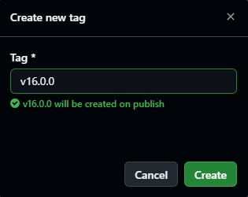

A su vez, también debemos especificar un titulo y una descripción para la release. De titulo pondremos el número de la versión, y de descripción pondremos los cambios que se han realizado desde la última versión.

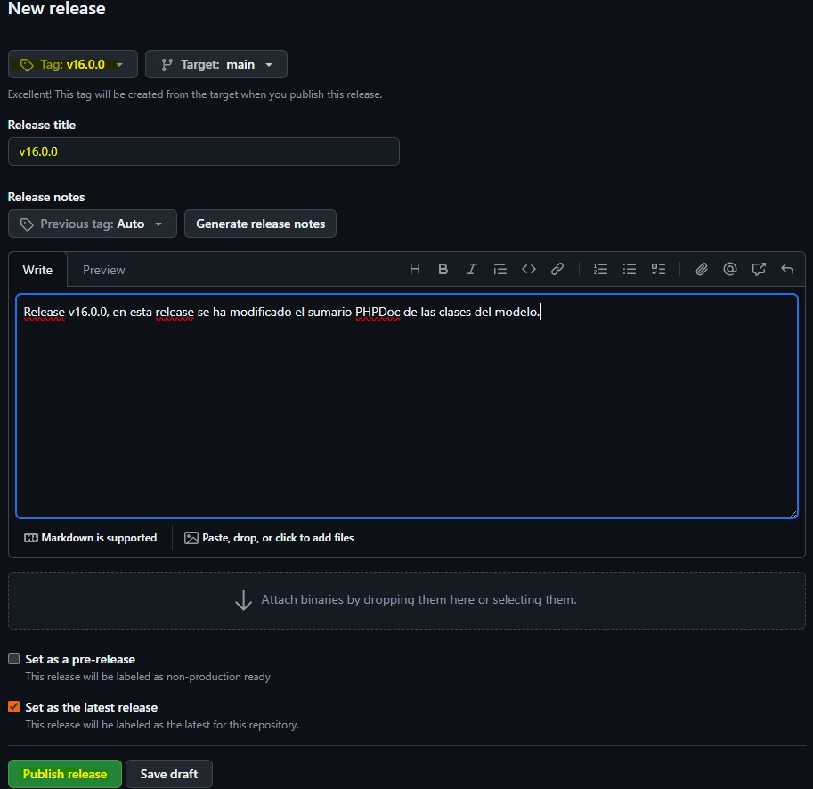

Tras publicar la release, deberemos de descargar el archivo .zip y descomprimirlo.

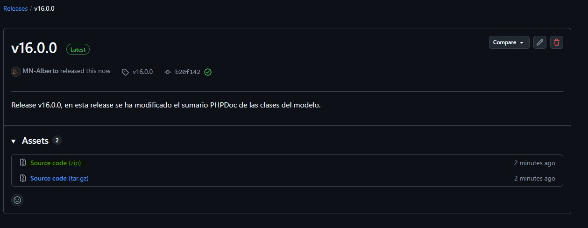

En nuestro caso, como la aplicación viene directamente del entorno de desarrollo, deberemos de cambiar la configuración de conexión a la base de datos por la del entorno de explotación.

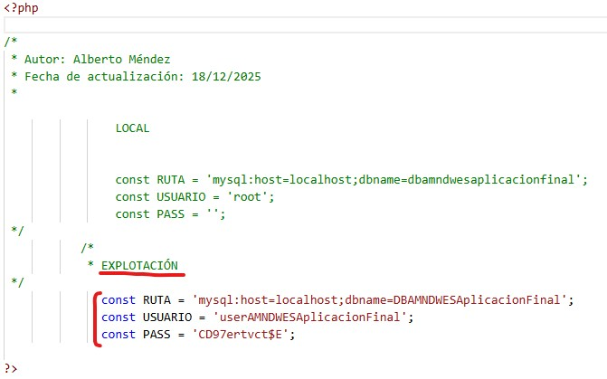

Después, nos dirigiremos a MobaXterm y crearemos una nueva sesión SFTP.
El "Remote Host" será la URL de nuestra web de explotación, "albertomennun.ieslossauces.es", y el nombre de usuario "albertomennun".

Al conectarnos, deberemos de dirigirnos a la carpeta "httpdocs", ya que es el directorio de publicación de nuestro usuario.

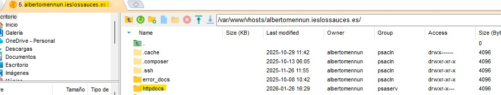

Al acceder a httpdocs, nos dirigiremos a la carpeta de nuestra aplicación final, y simplemente subiremos los archivos de la release que descargamos y descomprimimos.

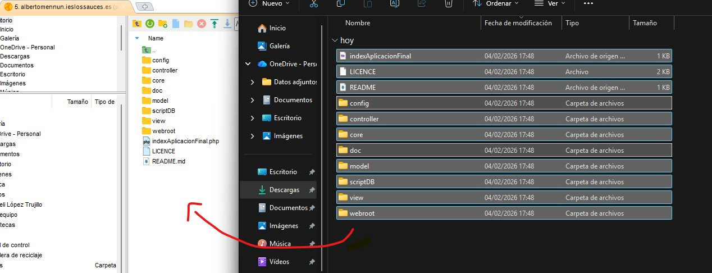

Y como podemos comprobar, si accedemos a la URL correspondiente a nuestra aplicación final podremos visitar la página.

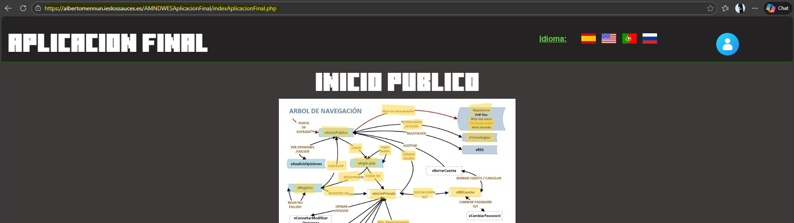

> **Nombre y Apellidos**  
> Alberto Méndez Núñez
> Curso: 2025/2026  
> 2º Curso CFGS Desarrollo de Aplicaciones Web  
> Despliegue de aplicaciones web